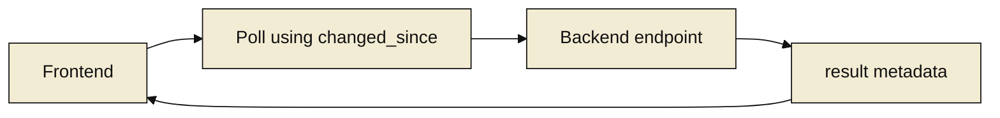
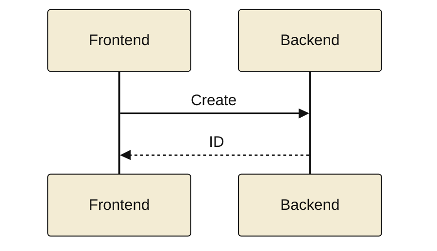

# Marked 2 Mermaid Patterns

## Minimal Style Block

Use once near the top of a standalone Markdown file:

```html
<style>
.mermaid,
.mermaid svg {
  background: transparent !important;
  background-color: transparent !important;
}
</style>
```

## Flowchart Template

This pattern is Marked 2 safe:

- It uses explicit theme variables.
- It enables HTML labels.
- It uses intermediate nodes instead of edge labels.
- It pins label text to a dark color with inline spans.



## Sequence Template



## Troubleshooting

- If text is too faint, set node labels with inline spans and explicit color `#111111`.
- If edge-label boxes look wrong, replace edge labels with intermediate nodes.
- If rendering differs between viewers, keep the same `init` and avoid extra CSS.
